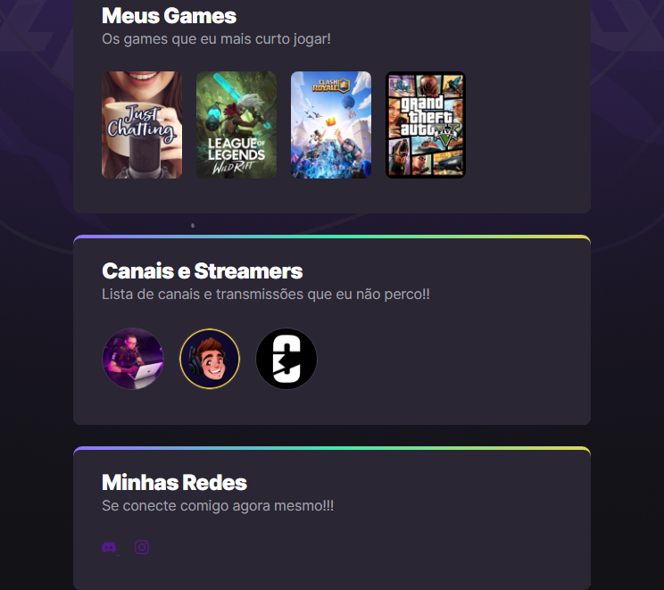

# NLW eSports - Trilha Explorer

> Trilha Explorer 

Projeto construído no Evento Next Level Week (NLW) da Rockseat.

[🔗 Acesse aqui](https://bruna-luc.github.io/NLW-eSport-Explorer/)
## 📚 Tecnologias 
- HTML
- CSS
- GIT & GitHub

## Conceitos/conhecimentos utilizados no projeto.

* HTML
  - Utilizado tag básicas 

* CSS
   - Construir a estilização básica dos elementos HTML
	- Animation
	- Transition

* Git e GitHub 
	- Entendo conceitos como do Git:
	    - Versionamento de código 
  - Link para compartilhar o projeto 
  - Fazer o README e documentação do projeto 
  - Linkando o projeto com meu VScode 

## 😁 Contato
bruna.o.fonseca@hotmail.com